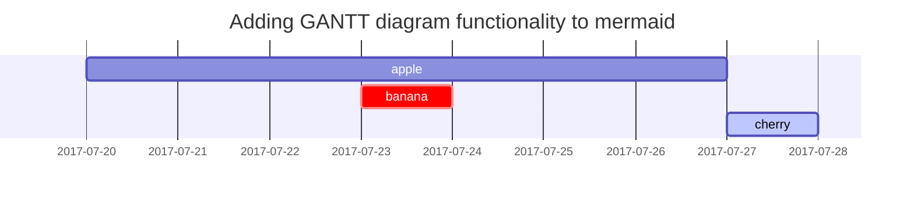

这篇文章用于展示 [**Chirpy**](https://github.com/cotes2020/jekyll-theme-chirpy/fork) 上的 Markdown 语法渲染效果，你也可以将其作为写作示例。现在，让我们开始看看文本与排版。


## 标题
---
# H1 - 一级标题

<h2 data-toc-skip>H2 - 二级标题</h2>

<h3 data-toc-skip>H3 - 三级标题</h3>

<h4>H4 - 四级标题</h4>
---
<br>

## 段落

我孤独地漫游，像一朵云

在幽谷与山巅之间飘荡，

忽然间我看见一群，

一片金色的水仙花；

在湖畔，在树下，

迎着微风起舞翩翩。

## 列表

### 有序列表

1. 第一项
2. 第二项
3. 第三项

### 无序列表

- 章
	- 节
      - 段

### 复选框列表

- [ ] 待办事项
- [x] 已完成
- 稍等
- [ ] 战胜 COVID-19
  - [x] 疫苗生产
  - [ ] 经济复苏
  - [ ] 人们再次微笑

## 引用

> 此行用于展示引用效果。

## 表格

| 公司                         | 联系人           | 国家 |
|:-----------------------------|:-----------------|-----:|
| Alfreds Futterkiste          | Maria Anders     | 德国 |
| Island Trading               | Helen Bennett    | 英国 |
| Magazzini Alimentari Riuniti | Giovanni Rovelli | 意大利 |

## 链接

<http://127.0.0.1:4000>


## 脚注

点击该钩子可以定位到脚注[^footnote]。


## 图片

- 默认（带说明文字）


_全屏宽度且居中显示_

<br>

- 指定宽度

{: width="400"}
_400px 图片宽度_

<br>

- 左对齐

{: width="350" .normal}

<br>

- 左浮动

  {: width="240" .left}
  "这里使用了一段重复且无意义的文本来填充空间。这里使用了一段重复且无意义的文本来填充空间。这里使用了一段重复且无意义的文本来填充空间。这里使用了一段重复且无意义的文本来填充空间。这里使用了一段重复且无意义的文本来填充空间。这里使用了一段重复且无意义的文本来填充空间。这里使用了一段重复且无意义的文本来填充空间。这里使用了一段重复且无意义的文本来填充空间。这里使用了一段重复且无意义的文本来填充空间。这里使用了一段重复且无意义的文本来填充空间。这里使用了一段重复且无意义的文本来填充空间。这里使用了一段重复且无意义的文本来填充空间。"

<br>

- 右浮动

  {: width="240" .right}
  "这里使用了一段重复且无意义的文本来填充空间。这里使用了一段重复且无意义的文本来填充空间。这里使用了一段重复且无意义的文本来填充空间。这里使用了一段重复且无意义的文本来填充空间。这里使用了一段重复且无意义的文本来填充空间。这里使用了一段重复且无意义的文本来填充空间。这里使用了一段重复且无意义的文本来填充空间。这里使用了一段重复且无意义的文本来填充空间。这里使用了一段重复且无意义的文本来填充空间。这里使用了一段重复且无意义的文本来填充空间。这里使用了一段重复且无意义的文本来填充空间。这里使用了一段重复且无意义的文本来填充空间。"

<br>

## Mermaid SVG



## 行内代码

这是 `行内代码` 的示例。

## 数学公式

数学公式由 [**MathJax**](https://www.mathjax.org/) 提供支持：

$$ \sum_{n=1}^\infty 1/n^2 = \frac{\pi^2}{6} $$

当 \\(a \ne 0\\) 时，方程 \\(ax^2 + bx + c = 0\\) 有两个解：

$$ x = {-b \pm \sqrt{b^2-4ac} \over 2a} $$

## 代码片段

### 通用

```
This is a common code snippet, without syntax highlight and line number.
```

### 指定语言

#### Console

```console
$ date
Sun Nov  3 15:11:12 CST 2019
```


#### Terminal

```terminal
$ env |grep SHELL
SHELL=/usr/local/bin/bash
PYENV_SHELL=bash
```

#### Ruby

```ruby
def sum_eq_n?(arr, n)
  return true if arr.empty? && n == 0
  arr.product(arr).reject { |a,b| a == b }.any? { |a,b| a + b == n }
end
```

#### Shell

```shell
if [ $? -ne 0 ]; then
    echo "The command was not successful.";
    #do the needful / exit
fi;
```

#### Liquid


```liquid

  This product's title contains the word Pack.

```


#### Html

```html
<div class="sidenav">
  <a href="#contact">Contact</a>
  <button class="dropdown-btn">Dropdown
    <i class="fa fa-caret-down"></i>
  </button>
  <div class="dropdown-container">
    <a href="#">Link 1</a>
    <a href="#">Link 2</a>
    <a href="#">Link 3</a>
  </div>
  <a href="#contact">Search</a>
</div>
```

#### Java

```java
private void writeObject(java.io.ObjectOutputStream s)
  throws java.io.IOException {
  // Write out any hidden serialization magic
  s.defaultWriteObject();

  // Write out HashMap capacity and load factor
  s.writeInt(map.capacity());
  s.writeFloat(map.loadFactor());

  // Write out size
  s.writeInt(map.size());

  // Write out all elements in the proper order.
  for (E e: map.keySet())
    s.writeObject(e);
}
```

## 反向脚注

[^footnote]: 脚注来源。
